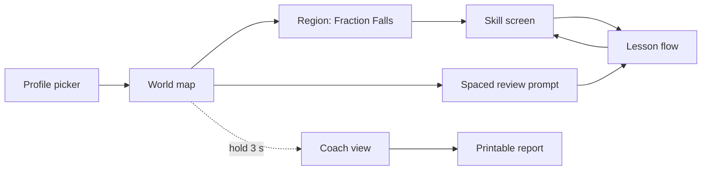
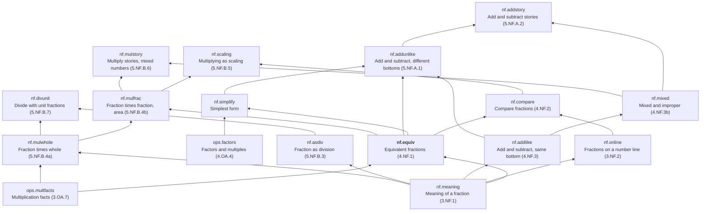
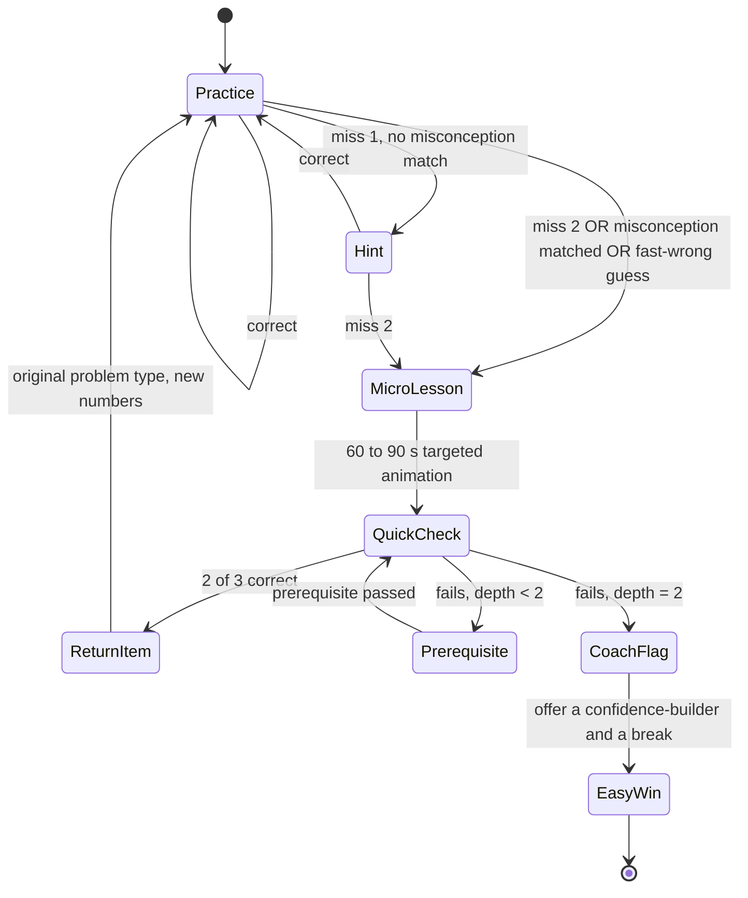

# Fraction Quest Universe: design

Status: Phase 0 (plan). No world code exists yet. This document is the contract for Phase 1
and is updated whenever a decision changes. Sections marked **Decision** are settled; sections
marked **Open** need the owner's call before the phase that depends on them.

The existing app in this repository is Fraction Quest 2 (FQ2): `src/core.js`, `src/st_a.js` to
`src/st_d.js`, `src/glass.css`, `src/style.css`, built by `build_cf.py`. The brief's
`reference/fq2/` folder is not present; this repository's `src/` is treated as that reference.

## 0. What FQ2 already gets right (kept)

Verified by reading the source, not inferred:

| FQ2 mechanic | Where | Carried into the Universe as |
| --- | --- | --- |
| Typed answers in whole / top / bottom boxes, half-filled answers rejected before grading (`toVal`) | `core.js` `ask`, `toVal` | Answer widget `FractionInput`; invalid-shape answers never count as attempts |
| Fast wrong answer (< 3500 ms) is a guess, never praised, routes to step-by-step | `QUICK_MS`, `st_c.js` `startGuided` | Rule G1 in the adaptive engine; `guess` flag on every attempt |
| Misconception computed from the answer value (`diagnose`, `diagFrac`, `explains`) | `core.js`, `st_c.js` | Misconception catalog with `detect(answer, item)` predicates and the collision tests in section 8 |
| Meters fill only for clean (unaided, first-try) items | `progress`, `finishItem` | Rule M1: progress meters and mastery count unaided correct answers only |
| Comeback problems: a missed problem type re-queues with fresh numbers | `st_c.js` `queue` | ReturnItem state plus spaced review |
| Guided fallback: same problem, one step at a time, each step graded | `stepGcf`, `stepDivide`, `stepMixedOrFinal` | Guided practice mode, generated from the engine step trace |
| Student-built prime factor trees | `st_b.js`, `body.html` tree SVGs | Manipulative `FactorTree` (Phase 2, simplify skill) |
| Mistake detective (name the mistake in a worked answer) | `st_c.js` `S6` | Item type `detective` tied to misconception ids |
| On-screen keypad on coarse pointers, `inputmode=none` to suppress the iOS keyboard | `Keypad` | Kept as is, ported to TypeScript |
| Glass light-table visual system with three depth levels, dark theme, reduced motion | `glass.css`, `style.css` | Section 6 token set; the world map is drawn on the same light table |
| Coach report with per-station attempt kinds, quick-miss count, guided count | `st_d.js` `renderCoach` | Coach view, section 7 |
| Plain-language copy: top, bottom, goes into, left over | README writing style | Content style guide, section 6.5 |
| Strict CSP, self-hosted fonts, offline service worker, no third-party requests | `public/_headers`, `sw.template.js` | Kept; see section 9 for the one CSP relaxation we keep from FQ2 |

Two things in FQ2 conflict with the brief and are fixed in Phase 2 when its content is ported:

1. **Licensed names in story problems.** `st_d.js` uses Ragatha and Gangle (The Amazing Digital
   Circus) and Soos (Gravity Falls). The brief forbids this. The string scanner (section 8.5)
   carries a denylist so it cannot come back.
2. **Progress in `localStorage` as one blob, single learner.** Replaced by the IndexedDB model
   in section 5. FQ2 progress is imported once on first launch (best effort, never blocks).

## 1. Product shape

A learner picks a profile, lands on the world map, enters a region, and plays a skill. Each
skill is a lesson (hook, walkthrough, guided practice, independent practice, knowledge check)
wrapped in the adaptive engine. Mastered skills come back as spaced review. An adult opens the
coach view with a 3 second hold.



### 1.1 World and guide (all original)

- **World:** The Glass Isles. Five islands float over the light table, one per CCSS domain.
  Fraction Falls (5.NF) is open. Place Value Peaks (5.NBT), Expression Canyon (5.OA),
  Volume Vale (5.MD), and Grid Gardens (5.G) are drawn on the map and marked "Coming soon".
- **Guide:** Lumen, a small lantern creature made of light. Lumen explains, points, and cheers.
  Lumen never says "wrong"; Lumen says what was right and names one thing to fix.
- **Story cast:** original kids and animals with ordinary situations: Maya, Theo, Priya, Jun,
  Rosa, Kofi, a dog named Biscuit, a class garden, a bake sale, a bike trail. The cast list is
  a content file and the string scanner only allows names from it in story templates.

## 2. Skill graph

Skills are nodes. Edges are prerequisites. Remediation walks edges downward at most two levels
from the skill being practiced. Every item is tagged with exactly one `skillId`.

### 2.1 Node schema

```ts
interface Skill {
  id: string;                 // "nf.equiv"
  world: "nf" | "nbt" | "oa" | "md" | "g";
  title: string;              // learner-facing, grade 4 to 5 reading level
  ccss: string[];             // ["5.NF.A.1"] (prerequisite skills carry 3.NF / 4.NF codes)
  prereqs: string[];          // skill ids; order = which to drop to first
  representations: Rep[];     // which of area | line | bar | set | symbol this skill supports
  lesson: string;             // lesson content id
  itemTemplates: string[];    // template ids whose items count toward this skill
  misconceptions: string[];   // misconception ids this skill can detect
}
type Rep = "area" | "line" | "bar" | "set" | "symbol";
```

### 2.2 Fraction Falls graph (Phase 1 node in bold)



Notes:

- `nf.equiv` is CCSS 4.NF.1, not 5.NF. It is the right vertical slice anyway: it is the
  prerequisite that 5.NF.A.1 fails on most often, and it exercises every state in the engine.
- Depth from `nf.equiv`: depth 1 = `nf.meaning`, `ops.multfacts`; depth 2 = none (both are
  roots). So the depth-2 remediation run in the e2e suite (section 8.4) uses `nf.addunlike`
  (depth 1 `nf.equiv`, depth 2 `nf.meaning`) once Phase 2 exists; in Phase 1 the depth-2 path
  is driven with a test-only skill fixture that has a two-level chain.
- Root skills (`nf.meaning`, `ops.multfacts`, `fl`, `fac`) ship with a micro-lesson and quick
  checks only in Phase 1. Their full lessons are Phase 2.

### 2.3 Other worlds

Stubbed as `world` entries with `status: "soon"` and zero skills. Adding a world is a content
drop: a world file, skill files, lesson files, item templates, misconception entries. No engine
or UI code change is expected; the Phase 2 exit check is that Fraction Falls content was added
without touching `src/engine` or `src/ui` for content reasons.

## 3. Misconception catalog

Each entry is a predicate over (item, answer) that returns true when the answer is exactly what
that misconception produces. Detection is computed, never guessed. A misconception entry also
names the micro-lesson that fixes it.

```ts
interface Misconception {
  id: string;
  skills: string[];            // where it can fire
  label: string;               // coach-facing, plain
  learnerFix: string;          // one sentence, the one thing to fix, grade 4 to 5
  microLesson: string;         // lesson id, 60 to 90 s
  detect: (item: Item, answer: Answer) => boolean;   // in engine code, keyed by id
}
```

The predicates live in `src/engine/misconceptions/*.ts` (they are code). Everything else about
the entry (labels, lesson id, which skills) is content in `content/misconceptions.json`.

### 3.1 Starter catalog (brief) plus FQ2 catalog, merged

| id | Fires on | Produces (example on the item) | Fix shown |
| --- | --- | --- | --- |
| `adds-denominators` | addlike, addunlike | 1/4 + 1/4 = 2/8 | Pieces are the same size, so count tops only |
| `whole-number-bias` | compare, equiv | says 1/8 > 1/4 because 8 > 4 | Bigger bottom means smaller pieces |
| `scales-numerator-only` | equiv | 2/3 = 4/3 | Multiply top and bottom by the same number |
| `scales-denominator-only` | equiv | 2/3 = 2/6 | Same as above, other half |
| `adds-to-both` | equiv | 2/3 = 3/4 (added 1 to both) | Multiply, do not add |
| `different-scale-factors` | equiv, simplify | 2/3 = 4/9 | Same number top and bottom |
| `not-simplified` (FQ2 `early`) | simplify, addunlike, mul | 6/8 instead of 3/4 | Keep going until nothing goes into both |
| `inverts-wrong-fraction` | divunit | 1/2 ÷ 3 = 2 × 3 | Flip the second fraction, not the first |
| `mixed-as-multiply` | mixed, mulstory | 2 1/3 read as 2 × 1/3 = 2/3 | A mixed number is wholes plus a part |
| `remainder-mishandled` (FQ2 `wholes`, `wrongDen`) | mixed, asdiv | 7/3 = 2 1/7 or 3 1/3 | Left-over pieces keep the same bottom |
| `drops-numerator` (FQ2 `drop`) | simplify, equiv | writes 4 for 2/4 | A fraction needs a top and a bottom |
| `subtracts-instead` (FQ2 `subtract`) | simplify | 6/8 = 4/6 | Subtracting changes the amount |
| `zero-numerator` (FQ2 `zero`) | simplify | 0/3 after cancelling | When all cancels, 1 is left |
| `not-a-factor` (FQ2 `notFactor`) | simplify, factors | divides 9 and 12 by 2 | Pick a number that goes into both evenly |
| `not-greatest` (FQ2 `notGreatest`) | simplify | divides 12/18 by 2 only | There is a bigger one |
| `part-as-whole` (FQ2 `partWhole`) | stories | uses one part as the whole | The whole is everything together |
| `wrong-part` (FQ2 `complement`) | stories | answers for the other part | Check which part the question asks about |
| `counts-ticks-not-gaps` | online, equiv (line rep) | places 1/4 at the 4th tick on a 0 to 1 line split in 4 | Count the jumps, not the lines |
| `arith-slip` | all | off by one on an otherwise right method | Check the multiply or divide step |

### 3.2 Collision rule

For every template and every misconception it maps, the test in 8.2 generates thousands of items
and asserts: the misconception's generated wrong answer is not equal in value to the correct
answer, and `detect` returns true for it. If a generator can produce an item where a
misconception collides with the right answer (for example `scales-numerator-only` on 0/5), the
generator must exclude that item (numerators are at least 1), and the test proves it.

When two misconceptions both match one answer, the catalog order per skill decides which is
reported, and the collision test flags it as a warning so the ambiguity is a deliberate choice.

## 4. Lesson structure

Every skill lesson is content with this shape:

```
Hook (10 to 20 s)  ->  Walkthrough (step cards, tap to advance, replay any)  ->
Guided practice (scaffolded steps, hints)  ->  Independent practice  ->
Knowledge check (3 to 5 items, no hints)
```

```ts
interface Lesson {
  id: string;
  skillId: string;
  hook: { scene: SceneSpec; caption: string; durationMs: number };
  walkthrough: { generator: string; params: ParamSpec; reps: Rep[] };   // steps come from the engine trace
  guided: { templates: string[]; count: number; hints: true };
  independent: { templates: string[]; count: number };
  check: { templates: string[]; count: 3 | 4 | 5; reps: Rep[] };       // at least two reps
}
interface MicroLesson {
  id: string;
  misconceptionId?: string;      // targeted fix
  skillId: string;               // or prerequisite refresher
  walkthrough: Lesson["walkthrough"];
  quickCheck: { templates: string[]; count: 3 };
  durationMsTarget: 60000 to 90000;
}
```

### 4.1 Walkthroughs are generated, not authored

The engine solves a problem and emits a step trace. The walkthrough renderer turns the trace
into scene keyframes, and the view draws each keyframe in SVG, animating between keyframes with
the Web Animations API. Because the trace is the same object the grader used, the final
keyframe always equals the graded answer, and the automated check in 8.3 enforces it.

```ts
interface Step {
  kind: "split" | "merge" | "shade" | "slide" | "label" | "compare" | "write";
  say: string;              // caption, grade 4 to 5, generated from a template with the step's numbers
  before: Scene;            // value state before
  after: Scene;             // value state after
}
interface Scene {
  rep: Rep;
  wholes: number;
  parts: { n: number; d: number }[];   // shaded pieces as exact fractions
  marks?: { at: Rational; label: string }[];   // number line marks
  equation: string[];                  // "2/3", "=", "4/6"
}
```

Example trace for equivalent fractions, area model, 2/3 to sixths:

1. `shade` 2 of 3 columns. "Here is 2 thirds."
2. `split` each column into 2. "Cut every piece into 2. Now there are 6 pieces."
3. `label` shaded count. "The shaded part did not change. 4 of 6 are shaded."
4. `write` 2/3 = 4/6. "2 thirds and 4 sixths are the same amount."

Reduced motion: each keyframe is drawn as a still; "Next" steps through them.

### 4.2 Representations

| Rep | Equivalent fractions manipulative | Direct manipulation |
| --- | --- | --- |
| area | Square split into columns; learner taps a split button to cut every piece in 2, 3, 4 | tap to split, tap to shade |
| bar | FQ2 tile tray (`Tray`) with chunk and merge | drag a chunk outline to group tiles |
| line | 0 to 1 line with tick marks; learner adds ticks between | drag a tick handle, tap a point |
| set | Groups of objects; regroup 2 of 4 marbles into 1 of 2 groups | drag objects into group outlines |
| symbol | Fraction boxes, keypad | type |

Mastery requires correct unaided answers in at least two of these (rule M2). The knowledge check
is built from at least two.

## 5. Adaptive engine

### 5.1 State machine (as specified in the brief, implemented exactly)



The engine is a pure reducer: `(EngineState, Event) -> EngineState` plus a list of effects
(`showItem`, `playMicroLesson`, `flagCoach`). No DOM, no timers inside. Timing arrives as the
`elapsedMs` field on the `answer` event, so the reducer is unit-testable for every transition.

```ts
type Phase =
  | { t: "practice" }
  | { t: "hint"; itemId: string }
  | { t: "microLesson"; lessonId: string; depth: number; cause: Cause }
  | { t: "quickCheck"; lessonId: string; depth: number; results: boolean[] }
  | { t: "prerequisite"; skillId: string; depth: number }
  | { t: "returnItem"; templateId: string }
  | { t: "coachFlag" }
  | { t: "easyWin" };
type Cause = { kind: "miss2" } | { kind: "misconception"; id: string } | { kind: "guess" };
```

### 5.2 Refinements (proposed; the machine above stays the implemented default)

R1. **Guess handling.** The brief's rules say a guess "routes to guided mode, never to praise";
the machine routes it to MicroLesson. These are reconciled without changing the machine: when
`cause.kind === "guess"`, the MicroLesson played is the *guided replay* of the same problem
(FQ2's step-by-step fallback generated from the trace), not a concept micro-lesson. A guess is
weak evidence of a misconception, so a 90 s concept lesson would be the wrong medicine. The
QuickCheck that follows still runs.

R2. **Prerequisite state is itself MicroLesson plus QuickCheck one level down.** "Prerequisite
passed" means the prerequisite's own quick check scored 2 of 3. If it fails and depth < 2, drop
again; at depth 2, CoachFlag. Depth is counted from the skill being practiced, so the learner is
never more than two skills away from where they started (rule D1).

R3. **Return path is explicit UI.** After ReturnItem the lesson rail shows "Back to Equivalent
fractions" with the breadcrumb of where they went, so the learner sees the path back.

R4. **Timer start.** The 3.5 s guess clock starts when the item is fully drawn and any
read-aloud has finished. Otherwise learners with read-aloud on are flagged as guessers.

R5. **A guess on a knowledge-check item** counts as a miss for mastery but does not trigger the
micro-lesson until the check ends; the check is "no hints", so remediation waits.

### 5.3 Rules

- **G1** Wrong and `elapsedMs < 3500` is a guess. Feedback: "That was quick. Take a moment and
  work it out." Never praise, never confetti. Logged with `guess: true`.
- **M1** Progress meters and mastery count only unaided correct answers: no hint shown, no
  guided mode, first try on that item.
- **M2** Mastery: 4 of the last 5 unaided items correct, spanning at least two representations
  among those correct items. Knowledge-check items are part of the window.
- **M3** Mastered skills enter spaced review at +1, +3, +7 sessions. A failed review demotes to
  `practice`, not to `fresh`. A passed +7 review marks the skill `retained`.
- **D1** Remediation depth is capped at 2. CoachFlag never traps: EasyWin offers one item the
  learner has already mastered (or a `nf.meaning` shading item if nothing is mastered) and a
  "take a break" button that returns to the map.
- **H1** Hints never state the key value. For equivalent fractions the key value is the scale
  factor; for simplifying it is the GCF. Hints are generated from the trace with the key value
  masked ("What number turns 3 into 12?" is allowed; "Multiply by 4" is not).
- **H2** Hint ladder: 1 = restate with a picture, 2 = point at the step, 3 = guided mode. Any
  hint marks the item aided.
- **S1** A session is: app opened and at least one attempt made, ending after 30 minutes idle or
  app close. Review schedule counts sessions, per the brief. **Open:** sessions can be 10
  minutes apart on one afternoon, which makes "7 sessions later" much shorter than a week.
  Proposal: a session also requires a different calendar day from the previous session to count
  for review scheduling. Implemented as a flag, default on, so the pure-sessions rule is one
  content constant away.

### 5.4 Skill state

```
fresh -> learning -> practice -> mastered -> review(1) -> review(3) -> review(7) -> retained
                        ^                                   |
                        +------------- failed review -------+
```

## 6. Data model and persistence

### 6.1 IndexedDB

Database `fqu`, versioned. Stores:

| Store | Key | Holds |
| --- | --- | --- |
| `meta` | `"schema"` | `{ version, createdAt, lastOpenedAt }` |
| `profiles` | `profileId` | `{ id, nickname, avatarId, createdAt, settings }` |
| `skillState` | `[profileId, skillId]` | `{ state, window: AttemptSummary[5], repsSeen, masteredAt, reviewDue: sessionIndex, remediationDepth }` |
| `attempts` | auto | `{ profileId, skillId, templateId, itemSeed, rep, correct, aided, guess, misconceptionId, elapsedMs, phase, sessionId, at }` |
| `sessions` | `sessionId` | `{ profileId, index, startedAt, endedAt, dayKey }` |
| `remediation` | auto | `{ profileId, skillId, path: string[], outcome, at }` |

Everything the UI shows is derived from `skillState` plus a bounded read of `attempts`. The
coach view aggregates `attempts` per skill.

Items are stored by `templateId + itemSeed`, never by full content, so an item can be regenerated
for the coach view with a seeded RNG.

### 6.2 Migrations and recovery

- `migrations: Array<(db, tx) => void>` indexed by version. `onupgradeneeded` runs them in order.
- Open failures, `VersionError`, blocked upgrades, or a `meta.schema` that fails validation:
  delete the database, recreate at current version, show one toast: "Progress could not be read.
  Starting fresh." Never throw to the UI.
- Private browsing with IndexedDB unavailable: in-memory store with the same interface and a
  banner "Progress will not be saved on this device."
- Coach view has Export (JSON file download) and Import, so a device wipe is recoverable.

### 6.3 Profiles

Nickname (1 to 16 characters) and avatar id. No PII beyond that; the UI copy asks for "a nickname
or first name". Up to 8 profiles. Settings per profile: read-aloud, dyslexia font, reduced
transparency, theme, sound.

### 6.4 Content files

`content/` is data, loaded at build time (imported JSON, type-checked by a content lint test):

```
content/
  worlds.json              five worlds, status, map anchors
  skills/nf.json           skill nodes and edges for Fraction Falls
  lessons/nf.equiv.json    lesson and micro-lessons
  templates/nf.equiv.json  item templates: generator id, param ranges, rep, skill, misconceptions
  misconceptions.json      labels, fixes, micro-lesson links (predicates are code, keyed by id)
  strings/en.json          every user-facing string, with ids
  cast.json                allowed story names
```

An item template:

```json
{
  "id": "equiv.find-numerator.area",
  "skillId": "nf.equiv",
  "generator": "equivMissingPart",
  "params": { "d": [2, 12], "k": [2, 6], "missing": "numerator" },
  "rep": "area",
  "misconceptions": ["scales-denominator-only", "adds-to-both", "different-scale-factors", "arith-slip"],
  "prompt": "strings:equiv.find-numerator.prompt"
}
```

## 7. Visual system

### 7.1 Carry FQ2's light table forward

The glass tokens in `glass.css` (field, paper, ink, surface, g-fill, g-d1 to g-d3, pools, tint)
move to `src/ui/tokens.css` unchanged in meaning. Three depths stay: level 1 panels you look at,
level 2 the work surface, level 3 what you hold (keypad, dialogs). Dark theme, reduced
transparency (solid surfaces, no blur), and reduced motion (stills) are honored through the
same media queries plus a per-profile override.

### 7.2 World map

The map is one SVG on the light table. Islands are glass plates with a tinted pool under each
(`--pools` already has five tints; one per world). Open islands glow; "coming soon" islands are
frosted with a small sign. Skill nodes on an island are glass discs connected by light paths that
fill as skills are mastered. Review-due skills pulse gently (still in reduced motion, with a
badge).

### 7.3 Fraction tiles

`TILE` colors from FQ2 (color encodes piece size, 1 to 12) are kept so a learner who used FQ2
recognizes the pieces. Color is never the only signal: every tile also carries its label when
wide enough and a pattern fill when two sizes must be told apart in one view.

### 7.4 Accessibility checklist (tested, not aspirational)

- Touch targets at least 44 by 44 CSS px, including tick handles and tile grab zones.
- Contrast AA for text and for tile labels on each tile color (the `tileText` rule from FQ2
  stays, verified by an axe pass in Playwright).
- Full keyboard: every manipulative has a keyboard path (arrow keys move a tick, Enter splits).
- `prefers-reduced-motion`: Web Animations API animations are skipped; walkthroughs become
  step-through stills.
- Dyslexia-friendly font toggle: **Decision pending license check.** Candidate is OpenDyslexic
  (published under the SIL Open Font License). Lexend stays the default. The license text ships
  next to the woff2 like FQ2 does for its fonts.
- Read-aloud: Web Speech API `speechSynthesis`, off by default, visible toggle, every instruction
  and problem has a speaker button. No network; it uses the device voices.

### 7.5 Copy rules

Grade 4 to 5 reading level. Short sentences. Say top and bottom, goes into, left over. No em
dashes or en dashes anywhere in user-facing text (scanner, 8.5). Feedback states what was right
and names one thing to fix.

## 8. Coach view

Gate: press and hold the Lumen lantern for 3 seconds (keyboard: hold Enter). Per skill:
state, unaided accuracy, misconceptions observed with one regenerated example item each, guess
rate, time on task, remediation history (the path taken and the outcome). Print stylesheet
renders a one-page report; Export writes JSON.

## 9. Technical architecture

### 9.1 Layout (new, alongside FQ2 during Phase 1)

**Decision:** FQ2 keeps serving `/` until Phase 2 is complete. The Universe is a Vite project in
`universe/` that builds to `public/world/`. `build_cf.py` learns one step: run the Vite build and
copy its output. The installed iPad icon keeps opening the working quest while the slice is
built. At Phase 2 exit, the Universe takes `/` and FQ2 moves to `/classic/`.

```
universe/
  package.json           exact pins, no ranges
  vite.config.ts         base "/world/", no inline scripts, hashed assets
  index.html
  src/
    engine/              pure, no DOM: rational.ts, generators/, trace.ts, misconceptions/, adaptive.ts, mastery.ts, review.ts
    content/             typed loaders for ../../content/*.json and the content lint
    store/               idb.ts (open, migrate, recover), repositories per store, memory fallback
    ui/                  tokens.css, components (FractionInput, Keypad, Tray, AreaModel, NumberLine, SetModel), screens (map, skill, lesson, coach)
    walkthrough/         trace -> keyframes -> SVG + WAAPI
    a11y/                speech.ts, focus.ts, motion.ts
    sw/                  service-worker.ts source; a Vite plugin stamps the precache list at build
  test/
    unit/                vitest: engine, adaptive reducer, store migrations
    property/            fast-check: generators vs oracle, misconception collisions
    e2e/                 Playwright: iPad 1180x820, 1366x1024, laptop 1440x900
content/                 (repo root) data only
```

### 9.2 Dependencies (dev only; the shipped bundle has zero runtime dependencies)

Pinned exactly. Versions below are what the registry reported today and are re-checked at
install time; they are not guesses.

| Package | Version | Why |
| --- | --- | --- |
| vite | 8.3.2 | build |
| typescript | 7.0.2 | types, `strict`, `noUncheckedIndexedAccess` |
| vitest | 5.0.3 | unit and property tests |
| fast-check | 4.10.2 | property testing against the oracle |
| @playwright/test | 1.63.0 | e2e, uses the preinstalled Chromium in this environment |
| jsdom | 30.1.2 | walkthrough final-state check without a browser |

No PWA plugin: the service worker is hand-written like FQ2's `sw.template.js` so the CSP and the
cache list stay understood. No `idb` wrapper: the store is about 200 lines and the recovery
path needs direct control of `onblocked` and `VersionError`.

### 9.3 Math engine

Exact rational arithmetic on integers: `{ n: number; d: number }` normalized with `d > 0`, with
every operation asserting `Number.isSafeInteger`. Fifth-grade numbers never approach 2^53, and
the assertion makes that a tested fact rather than a hope. BigInt is reserved for the oracle so
the two implementations differ in substance.

The oracle (`test/property/oracle.ts`) is written independently: BigInt cross-multiplication for
equality, trial division for GCF, brute-force enumeration of equivalent fractions up to a bound.
It shares no code with `src/engine`.

### 9.4 Content Security Policy

Kept from `public/_headers` with one honest note: `style-src 'self' 'unsafe-inline'` stays.
Strict `style-src 'self'` blocks `style=""` attributes, which the SVG renderer uses for
per-tile animation delays and which FQ2 already relies on. Scripts stay strict (`script-src
'self'`), which is the part that matters for an app with no backend. The Vite build is checked in
CI for inline `<script>` tags and `eval` in output, the same way `build_cf.py` refuses inline
handlers today.

### 9.5 Offline

Service worker precaches the Vite manifest's output plus fonts and content. Cache name is the
build hash, as FQ2 does. First launch online, then fully offline, including read-aloud (device
voices) and all content (bundled).

## 10. Test strategy

### 10.1 Unit (vitest)

Adaptive reducer: a table test for every edge in the state machine, including depth 0, 1, 2 and
the guess cause. Mastery window: 4 of 5 with the two-representation rule, hint invalidation.
Review scheduler: +1, +3, +7, demotion. Store: every migration forward from every prior version
on a fixture database, plus corrupted blob and blocked upgrade recovery.

### 10.2 Property (fast-check, at least 2000 runs per template)

For every item template: generate, solve with the engine, check against the oracle. For every
misconception mapped to the template: produce the misconception answer, assert it differs in
value from the correct answer and that `detect` fires; assert `detect` does not fire on the
correct answer. Where two misconceptions can both match, the test reports the overlap.

### 10.3 Walkthrough final state

For every lesson walkthrough and micro-lesson, for 500 random parameterizations: build the trace,
render keyframes, assert the last keyframe's `Scene` value equals the engine answer, and that
every `after` of step i equals `before` of step i + 1.

### 10.4 End to end (Playwright, iPad 1180x820 and 1366x1024, laptop 1440x900)

Scripted learners drive the real UI with a seeded RNG exposed only under a test flag:

1. Perfect run: lesson to mastery, meter fills, review scheduled.
2. Guessing run: fast wrong answers, no praise, guided replay, quick check.
3. Misconception run: `scales-numerator-only` answers, micro-lesson, return item, back to
   practice.
4. Depth-2 run: fail quick checks twice, CoachFlag, EasyWin, map. Learner is never stuck.
5. Spaced review demotion: advance sessions, fail a review, state is `practice` not `fresh`.

Every run asserts zero console errors and zero failed requests, and runs an axe accessibility
scan on each screen.

### 10.5 Static scans

- All strings in `content/strings` and all literal text in `src/ui`: no U+2013, no U+2014.
- Denylist of licensed names (seeded with the names found in `st_d.js` and a list of common
  franchises); story templates may only use names from `content/cast.json`.
- Lighthouse PWA and accessibility categories at or above 90 on the built site.

## 11. Phase plan

### Phase 1: vertical slice (`nf.equiv`)

Exit criteria, each verified by a test named here:

- [ ] Engine: `equivMissingPart`, `equivFindPair`, `equivIsEquivalent` generators with traces
  (property suite green).
- [ ] Misconceptions for equiv detected and collision-tested.
- [ ] Lesson: hook, walkthrough (area and bar), guided, independent, knowledge check.
- [ ] Adaptive reducer with every transition unit-tested; micro-lessons for the three equiv
  misconceptions and the guess replay; quick checks; return item.
- [ ] Prerequisite drop to `nf.meaning` and `ops.multfacts` micro-lessons; depth-2 with fixture.
- [ ] Mastery, spaced review, demotion.
- [ ] Coach view with print and export.
- [ ] Store with migrations and recovery; profiles.
- [ ] Map with Fraction Falls open, four islands "coming soon".
- [ ] e2e runs 1 to 5 green on both iPad viewports; axe clean; string scan clean; Lighthouse
  thresholds met.

### Phase 2: Fraction Falls complete

All skills in 2.2, FQ2 mechanics ported (factor trees, detective, stories with the original cast),
FQ2 progress import, Universe moves to `/`.

### Phase 3+

Content drops per world. Each starts with its own skill graph and misconception catalog added to
this document.

## 12. Open questions (answer before Phase 1 starts; defaults in bold)

1. Review scheduling: **sessions on distinct days** (5.3 S1) or raw sessions as written?
2. Dyslexia font: **OpenDyslexic** pending license text check, or Atkinson Hyperlegible?
3. Phase 1 URL: **`/world/` beside FQ2** or replace `/` now?
4. Number range for `nf.equiv` items: **denominators 2 to 12, scale factors 2 to 6** (products
   to 72), matching FQ2's readable tile limit of 48 per bar for the bar representation, with
   the area model taking the larger ones.
